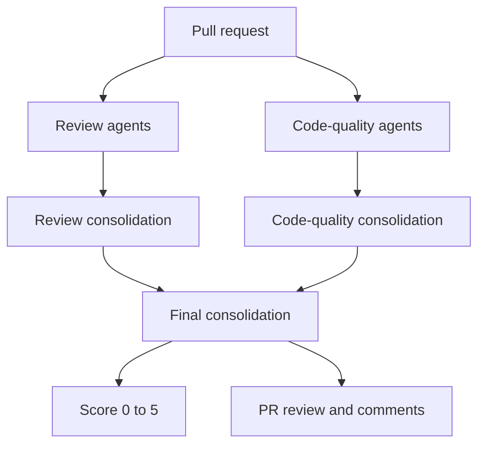

# Code Beat

Code Beat is a GitHub Action that reviews pull requests with OpenRouter, posts inline review comments, and publishes a score from 0 to 5.

It runs multiple independent AI reviewer passes in parallel, then consolidates their findings into one final review. The default setup uses `deepseek/deepseek-v4-flash`, two general review passes, and two thermo-nuclear code-quality passes.

The code-quality reviewers are intentionally strict about maintainability, structural simplification, file-size growth, spaghetti branching, abstraction boundaries, and type contracts.

## Quick Start

Add an `OPENROUTER_API_KEY` repository secret, then create `.github/workflows/code-beat.yml`:

```yaml
name: Code Beat

on:
  pull_request:
    types: [opened, synchronize, reopened, ready_for_review]

permissions:
  contents: read
  pull-requests: write
  issues: write

jobs:
  review:
    runs-on: ubuntu-latest
    steps:
      - uses: actions/checkout@v4
      - uses: relferreira/code-beat@main
        with:
          openrouter-api-key: ${{ secrets.OPENROUTER_API_KEY }}
```

That is enough for the default review pipeline:

- model: `deepseek/deepseek-v4-flash`
- general review agents: `2`
- thermo-nuclear code-quality agents: `2`
- max inline comments: `12`

## What It Posts

Code Beat creates one PR review summary with a score and, when useful, inline comments on added diff lines.

For a clean PR, it posts a normal PR comment with no inline comments:

```md
## 🥁 Code Beat review

**Score:** 🟢 **5/5** - Ship-shape

No issues found.

✨ **No inline comments from me.** This one kept the beat clean.

_Reviewed by Code Beat. Tiny drumsticks, serious standards._
```

For a risky PR, it posts a review with inline comments and a lower score.

## How the Agent Works

Code Beat is not a single prompt over a diff. It runs parallel review categories over the same PR context, then consolidates the strongest findings into one score and one review.



### Worker Agents

The default pipeline starts four workers:

| Worker type | Default count | Focus |
| --- | ---: | --- |
| General review | `2` | Correctness, regressions, edge cases, tests, security, privacy, performance, and confusing implementation choices. |
| Code-quality review | `2` | Thermo-nuclear maintainability review: abstraction quality, code shape, giant files, condition growth, type contracts, and structural simplification. |

Each worker runs independently. They all receive the same PR context and the same read-only tools, so disagreement is useful: the consolidator keeps the findings that survive multiple independent passes or are strongly grounded by one pass.

### Tool Loop

The worker agents can inspect more than the diff when they need it:

- pull request metadata
- existing PR comments and review comments
- repository instruction files
- full file contents from the checkout
- line windows around changed code
- repository file listing
- literal repository search

The tools are read-only and constrained to the checked-out repository.

### Consolidation

After workers finish:

1. General review outputs are consolidated.
2. Code-quality outputs are consolidated.
3. The final orchestrator merges both categories, removes overlap, assigns a score, and selects findings.
4. Code Beat only posts inline comments that map to added lines in the PR diff.

This keeps the public review concise even when several agents explored the PR.

### Error Handling

Code Beat is designed to keep useful review output even when one part of the pipeline is flaky:

- If one worker errors or returns invalid output, that worker is skipped.
- If a category consolidator fails, Code Beat falls back to normalized findings from valid workers in that category.
- If the final orchestrator fails, Code Beat falls back to normalized consolidated findings and a conservative score.
- If no valid findings survive, Code Beat posts a clean review instead of failing the workflow.

## Scoring

Scores are intentionally blunt:

| Score | Meaning |
| ---: | --- |
| `0` | Severe correctness or structural failure. |
| `1` | Major issues that should block merge. |
| `2` | Significant concerns. |
| `3` | Acceptable with notable improvements. |
| `4` | Good with minor concerns. |
| `5` | No clear concerns. |

Use `fail-on-score-below` if you want Code Beat to fail the check for low scores.

## Inputs

| Input | Required | Default | Description |
| --- | --- | --- | --- |
| `openrouter-api-key` | yes | | OpenRouter API key used to call the configured model. |
| `model` | no | `deepseek/deepseek-v4-flash` | OpenRouter model name. |
| `review-runs` | no | `2` | Number of independent general PR reviewer agents to run. Values are capped at `5`. |
| `code-quality-runs` | no | `2` | Number of independent thermo-nuclear code-quality reviewer agents to run. Values are capped at `5`. |
| `github-token` | no | `${{ github.token }}` | Token used to read PR files and create comments. |
| `max-comments` | no | `12` | Maximum number of inline review comments to create. Set to `0` for summary-only reviews. The agents may find more, but only the top commentable findings are posted. |
| `fail-on-score-below` | no | | Optional threshold between 0 and 5. The action fails when the score is below this value. |

Example with custom tuning:

```yaml
- uses: relferreira/code-beat@main
  with:
    openrouter-api-key: ${{ secrets.OPENROUTER_API_KEY }}
    model: deepseek/deepseek-v4-flash
    review-runs: 2
    code-quality-runs: 2
    max-comments: 8
    fail-on-score-below: 2
```

## Outputs

| Output | Description |
| --- | --- |
| `score` | Numeric score from 0 to 5. |
| `summary` | Review summary. |
| `inline-comments` | Number of inline comments posted. |

## Permissions

The default workflow needs:

```yaml
permissions:
  contents: read
  pull-requests: write
  issues: write
```

`contents: read` lets `actions/checkout` and the action inspect repository files. `pull-requests: write` lets Code Beat create PR reviews and inline comments. `issues: write` lets it create a normal PR conversation comment when there are no inline comments.

## Bot Identity

When using the default `${{ github.token }}`, GitHub shows comments as `github-actions`.

To use a custom name and avatar, pass a token from a GitHub App or dedicated bot account through `github-token`. GitHub controls the displayed author from the token identity; Code Beat can customize the comment body, but not the `github-actions` avatar/name produced by the default token.

## Development

Install dependencies:

```bash
npm install
```

Run checks:

```bash
npm test
npm run check
npm run build
```

The action is bundled into `dist/index.js`. Commit `dist/index.js` whenever TypeScript source changes.
